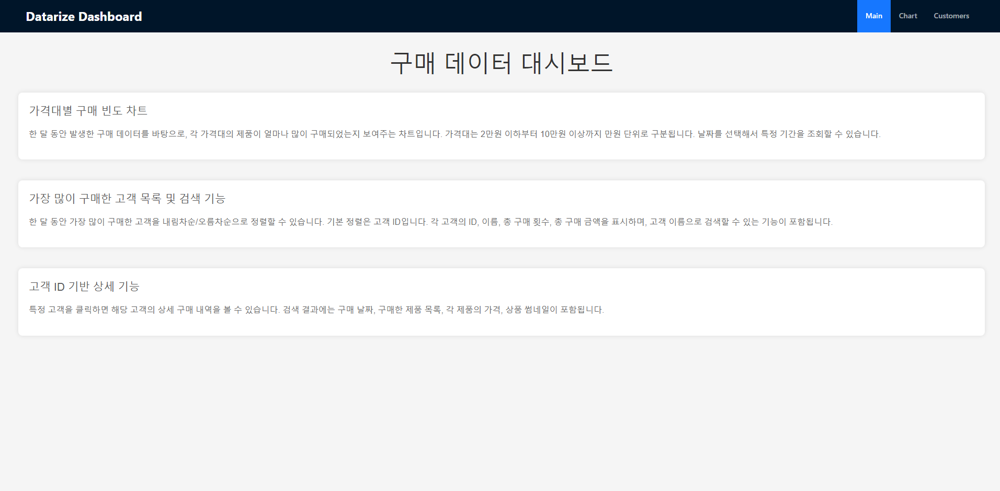
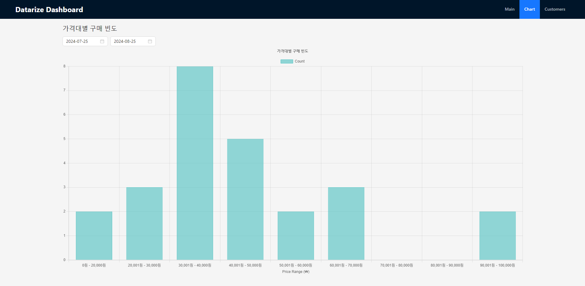
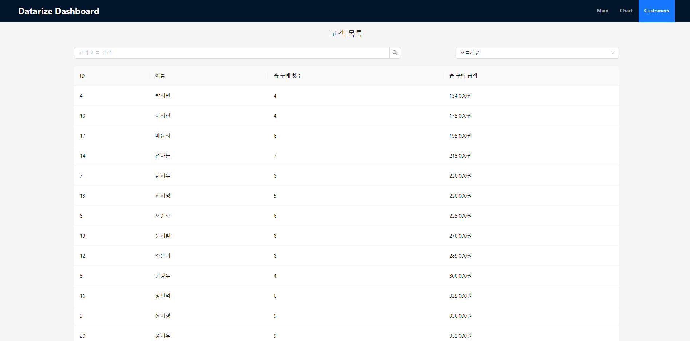

# Datarize Frontend 과제 전형

안녕하세요, Datarize Frontend Developer 지원자 김하늬입니다.

## 목차
1. [프로젝트 개요](#프로젝트-개요)
2. [기술 스택](#기술-스택)
3. [설치 및 실행](#설치-및-실행)
4. [폴더 구조](#폴더-구조)
5. [API 사용](#API-사용)
6. [메뉴](#메뉴)
7. [기능 설명](#기능-설명)

## 프로젝트 개요
React 및 TypeScript로 작성된 웹 애플리케이션입니다. 구매 빈도와 고객 목록을 관리하고 시각화합니다. Chart.js와 Ant Design을 활용해 데이터를 시각화합니다.

## 기술 스택
- **프론트엔드**: React, TypeScript
- **차트 라이브러리**: Chart.js
- **UI 라이브러리**: Ant Design

## 설치 및 실행

```bash
cd apps
yarn install
yarn start-server
yarn start-client
```

## 폴더 구조
```bash
/project-root
├── /src
│   ├── /api
│   ├── /assets
│   ├── /components
│   ├── /pages
│   └── types.ts
└── package.json
```

## API 사용

### `GET /api/purchase-frequency`
한 달 동안의 모든 구매 데이터를 반환합니다.

**쿼리 파라미터 (optional):**
- `from`: 시작 날짜 (ISO 8601 형식)
- `to`: 종료 날짜 (ISO 8601 형식)

### `GET /api/customers`
고객 목록을 반환합니다.

**쿼리 파라미터 (optional):**
- `sortBy`: 정렬 기준 (가능한 값: `asc`, `desc` - 구매 금액 순 정렬)
- `name`: 이름 검색

### `GET /api/customer/{id}/purchases`
특정 고객의 구매 내역을 반환합니다.


## 메뉴
### 1. Main

간단한 요구사항 정리 페이지입니다.

### 2. Chart

가격대별 구매 빈도를 바 차트로 시각화한 페이지입니다.

### 3. Customer

검색 및 정렬 기능이 있는 고객 목록 페이지입니다.

## 기능 설명

### 1. Main
- **요구사항 시각화**: 메인 페이지에서 주요 요구사항을 한눈에 확인할 수 있습니다.
- **메뉴바 추가**: 상단에 메뉴바를 배치해 사용자가 쉽게 네비게이션 할 수 있도록 편의성을 높였습니다.

### 2. Chart
- **구매 빈도 시각화**: 시간대별 구매 빈도를 바 그래프로 시각화했습니다.
- **기간 조회 기능**: `DatePicker`를 사용해 사용자가 날짜를 선택하여 특정 기간을 조회할 수 있습니다.
- **에러 및 로딩 처리**: 데이터 로딩 및 에러 발생 시 처리 로직을 구현했습니다.
- **그래프 클릭 기능**: 그래프의 특정 데이터를 클릭하면 해당 위치의 `count` 및 `range` 정보를 확인할 수 있습니다.

### 3. Customer
- **정렬 및 검색 기능**: 상단의 셀렉트 박스를 통해 고객 목록을 내림차순/오름차순으로 정렬할 수 있으며, 인풋박스에선 고객 이름으로 검색이 가능합니다.
- **고객 상세 정보 모달**: 특정 고객의 행을 클릭하면 해당 고객의 상세 정보를 모달로 표시합니다.
